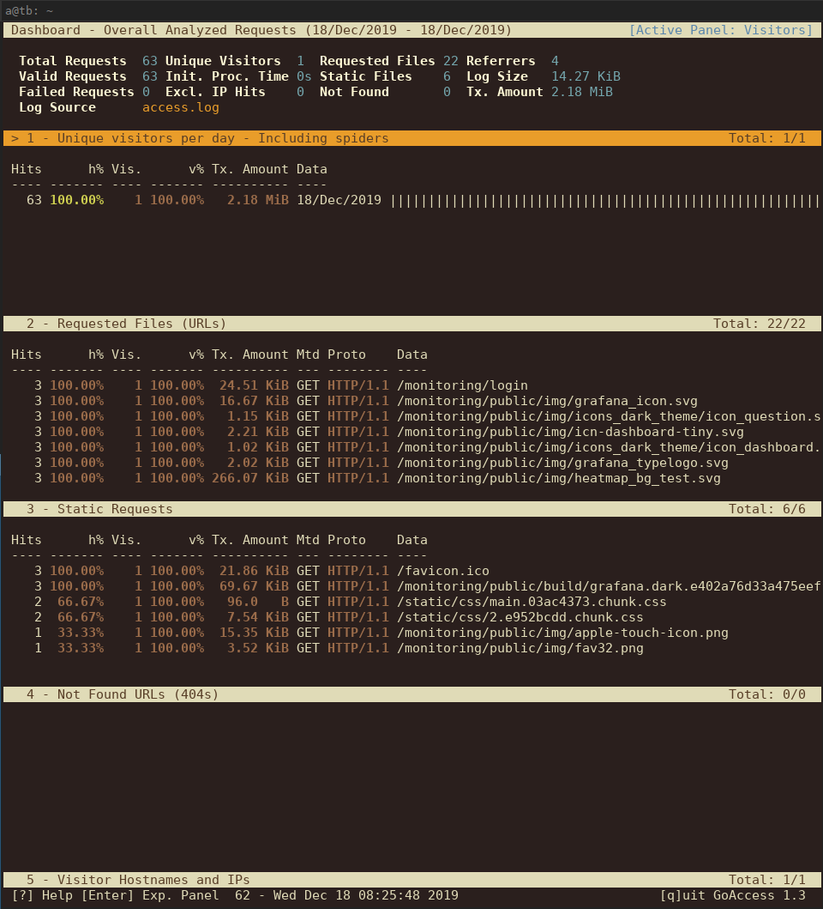

# HACC Project EV web interface

## About

### Project Video:

[](https://www.youtube.com/watch?v=YdtEFqkVBOk&feature=emb_title)

### Inspiration

We as a species must take decisive action to cut down carbon emission in order
to save our planet. Switching from a gas powered to an electric powered vehicle
is a fantastic way reduce our carbon footprint. That is why it is crucial that
our community's electric vehicle charging needs are being met. Our team is
committed to gather, interpret, and present the data from charging stations in
a meaningful and easy to understand way in order to better serve these needs.

### Overview

Our team is really excited to share our application that both serves the needs
of HECO administrators to visualize and interpret incoming charging station
telemetry, as well as the needs of consumers who want to find the closest open
and working station available.

### Administration Dashboard

We have leveraged proven and tested real time data monitoring solutions to
create a dashboard that is dynamic and can serve the changing needs of HECO.
Reports, alerts, sharing visualizations, and deep time series querying are all
made simple and accessible.

### Consumer Facing App

We have included an application that extends the capabilities of the fast
charging locations finder that is available on the HECO website. This app
includes a map indicating the various statuses of a given station, location
search with auto completion, and full integration with the our backend services
so that we can see where consumers are looking for stations.

## Post Competition Changes

The following includes changes applied after the HACC presentations. We came up
with some improvements to the web service and backend which we implemented over
the last week.

### Live access monitoring

To see usage of the front end we installed the open source tool
[goaccess](https://goaccess.io/) to see live logs of our running
[nginx](https://nginx.org) instance. Obviously real usage is low as the service
was never adapted by Hawaiian Electric, however it would offer usage details to
focus on specific devices and browsers. The `goaccess` tool show what path
where accessed by users or bots and therefore show what parts of the website
where of interest. Additionally it is possible to see the behaviour of bots
which usually try to access path like `/wp-admin.php` (WordPress administrator
interface) to run exploits.

As the tool runs only on the access logs of `nginx` no user tracking via
JavaScript is required, following one of the design goal to have a privacy
friendly service. Only the browser agent is stored, which is useful for
frontend developers. Supporting outdated versions of Internet Explorer can be
ignored once the logs shows low usage.

Lastly the stats show data transfer of files over time. We use compressions for
delivered scripts, however a high demand could exceed our included bandwidth
commitment booked by the hosting provider. Seeing these logs allows an
estimation over time.



The image above shows the deployed tool, the use for a not actively used web
service is limited, however is a useful base monitoring for real running
services.

### Overload prevention

As mentioned above we use `nginx` as a web server. We partly host content
directly, like the frontend apps HTML and JavaScript code, partly dynamically
generated content via the Python Web Framework
[Flask](https://www.palletsprojects.com/p/flask/) and ultimately the internal
monitoring frontend using `grafana`, to show station usage. Ultimately we have
the special case of a user facing API for location requests. This request
adds entries to our internal database and therefore requires special treatment
as described below.

All these resources scale on different level, static content directly hosted by
`nginx` is much faster served than our dynamically generated list of station
availability. To avoid abuse and server overloads by malicious users we use a
feature of `nginx` to [rate
limit](https://docs.nginx.com/nginx/admin-guide/security-controls/controlling-access-proxied-http/)
resource access.

As there are different kinds of rate limits to consider, they are described
individually below:

#### Prevent brute force attacks

The login to the internal monitoring works via a username and password
combination. The page is naturally publicly available to allow remote access.
However this opens the danger ob brute force password attacks. Brute force
works by testing all kinds of possible passwords, meaning a high number of
requests is performed against a single endpoint (`/monitoring/login`).
To protect this resource a limit is set to one request per 10 second.

```
limit_req_zone [...] rate=6r/m;
```

#### Prevent backend overload

The station availability is calculated based on data fetched and parsed from
`prometheus` over and internal HTTP connection. While `prometheus` and `flask`
are both fast, it requires much more server power than serving static files. To
avoid attacks on our backend we therefore apply a rule to limit requests to the
station status to one request per second.

To allow quick reloading we actually tell `nginx` to allow 60 requests per 60 seconds.

```
limit_req_zone [...] rate=60r/m;
```

#### Prevent location spoofing

Every time you open the web interface and allow your browser location access, a
request is send against our backend to track where people are while searching
for charging stations. This has the obvious advantage that once many people
look for stations somewhere far of available EVCs, the location for the next to
be build station is easy to determine.

However this service could be gamed by a malicious user generating many
requests from a single destination, e.g. in case the user wants a charger close
to his home location. For this reason the special path `/lookup` is limited to
a single request every minute. This way the initial location requests is added,
however reloading the app or maliciously spawning dozens of requests does not
harm our monitoring backend with false information.

One minute is a reasonable value as it allows a moving (co)driver to add
multiple lookups, like when driving down a highway, giving a more accurate
picture of where demand exists.

```
limit_req_zone [...] rate=1r/m;
```


## Links

### [Our Github](https://github.com/HACC2019/hacc-overflow/)

### [Deployed project](https://hacc.aparcar.org)

### [Live Dashboard](https://hacc.aparcar.org/monitoring/d/1iX4RMAWk/overview?orgId=1&refresh=1m&from=1573568903794&to=1573590503794) (Login: demo/demo)
